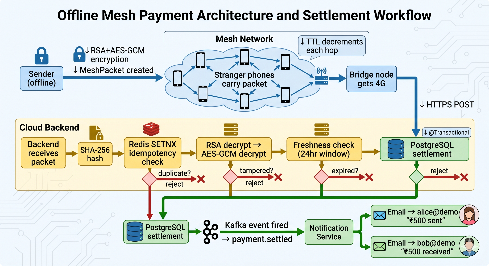
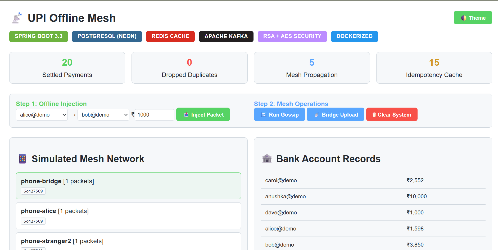
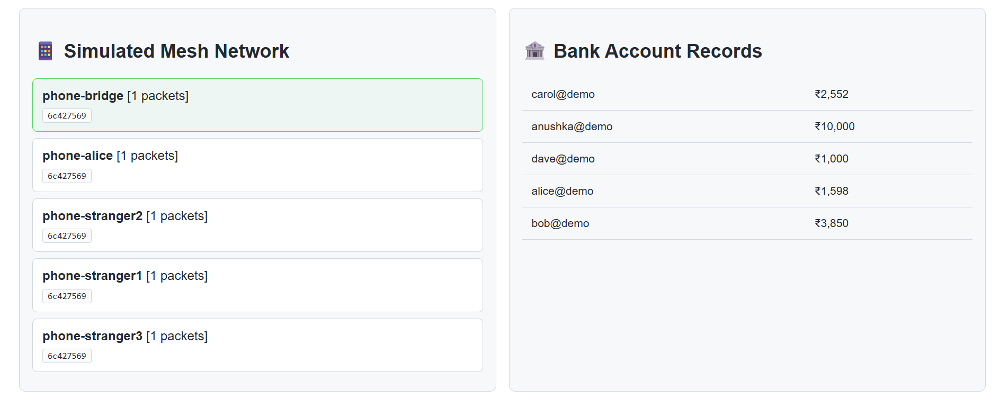
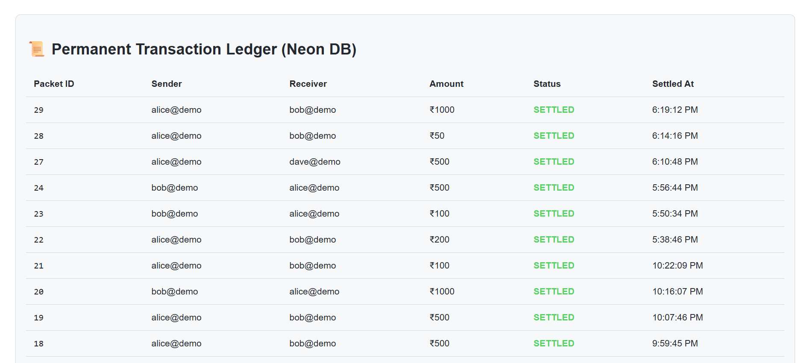
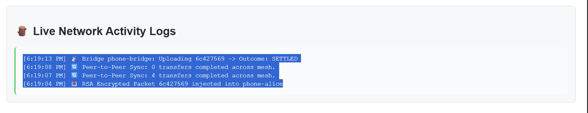
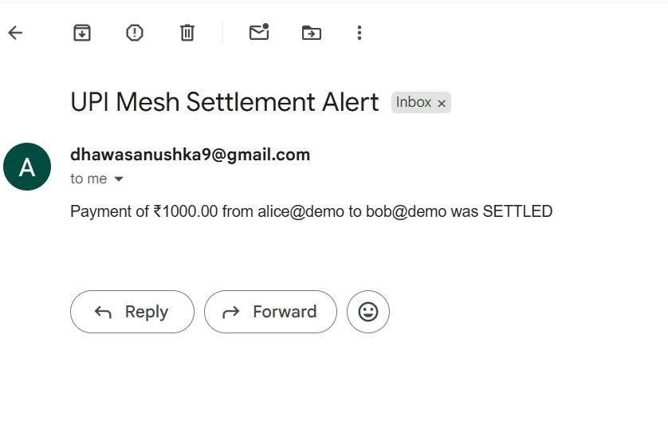

# 🛰️ Offline-Payment Platform

> Send money in a basement with zero internet.  
> Encrypted packets gossip phone-to-phone until  
> one reaches 4G and settles it — exactly once.

---

## 🎯 What This Solves

In India, millions face payment failures daily in:
- Metro stations
- Basements  
- Rural areas
- Crowded events

This platform allows UPI-style payments to travel 
peer-to-peer through nearby devices until one 
reaches internet and settles — securely and 
exactly once.

---

## 🏗️ Architecture

---

## ⚙️ Tech Stack

| Technology | Purpose |
|---|---|
| Spring Boot 3.3 | Core backend framework |
| PostgreSQL | Transaction ledger |
| Redis | Idempotency + deduplication |
| Apache Kafka | Async event pipeline |
| JavaMailSender | Email notifications |
| Docker Compose | Container orchestration |
| RSA-OAEP + AES-256-GCM | Hybrid encryption |
| Resilience4j | Circuit breaker + retry |

---
## 📸 Visual Overview

### 🖥️ Main Dashboard
Features real-time stats and the technology stack overview.

### 📱 Mesh & Ledger
Tracking packet propagation and database settlement.
| Mesh Devices | Transaction Ledger |
|---|---|
|  |  |

### ⚙️ System Logs & Notifications
| Activity Logs | Email Settlement |
|---|---|
|  |  |

---

## 🔐 The 3 Hard Problems Solved

### 1. Untrusted Intermediaries
Strangers carry your payment packet.  
Solution: RSA+AES-GCM hybrid encryption.  
Only the server can decrypt. Tampering = exception.

### 2. Duplicate Storm
3 bridge nodes upload same packet simultaneously.  
Solution: Redis atomic SETNX on SHA-256 hash.  
Exactly one settles. Two dropped instantly.

### 3. Replay Attacks
Old captured packet replayed weeks later.  
Solution: Nonce + timestamp inside encrypted payload.  
Anything older than 24hrs rejected automatically.

---
## ⚠️ Honest Limitations

| Limitation | Reason |
|---|---|
| Real Bluetooth not implemented | Simulated in software |
| Offline balance check not possible | Needs internet to verify funds |
| Not bank-grade KYC | Demo accounts only |

> These are inherent to offline payment systems.  
> Real solution: UPI Lite's pre-funded hardware wallet.

---
